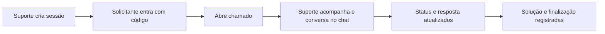

<div align="center">

# 🎫 TicketFlow

### Gestão de chamados de suporte em tempo real

Abra, acompanhe e resolva chamados entre solicitantes e equipe de suporte —
com chat ao vivo, relatórios operacionais e base de conhecimento.

[**🌐 Ver demo ao vivo →**](https://projetoticketflow-c3b5c.web.app)

<br>

[](https://vuejs.org/)
[](https://vitejs.dev/)
[](https://pinia.vuejs.org/)
[](https://firebase.google.com/)
[](https://www.chartjs.org/)
[](#-status-da-entrega)

</div>

---

## 📑 Índice

- [Sobre o projeto](#-sobre-o-projeto)
- [Funcionalidades](#-funcionalidades)
- [Stack](#-stack)
- [Estrutura](#-estrutura)
- [Modelo de dados](#-modelo-de-dados)
- [Segurança](#-segurança)
- [Como rodar localmente](#-como-rodar-localmente)
- [Scripts](#-scripts)
- [Deploy](#-deploy)
- [Status da entrega](#-status-da-entrega)
- [Autor](#-autor)

---

## 🎯 Sobre o projeto

O **TicketFlow** centraliza a abertura, o acompanhamento e a resolução de
chamados entre solicitantes e equipe de suporte. Tem autenticação, controle de
acesso por perfil, dados em tempo real no Cloud Firestore, chat por chamado,
relatórios operacionais e uma base de conhecimento para autoatendimento.



---

## ✨ Funcionalidades

<table>
<tr>
<td width="50%" valign="top">

### 🙋 Solicitante

- Cadastro, login, logout e recuperação de senha
- Entrada em uma sessão de atendimento por código do suporte
- Abertura de chamados com título, descrição, categoria, prioridade e local
- Listagem dos próprios chamados com filtros e busca
- Edição, cancelamento e exclusão enquanto o chamado está aberto
- Detalhes com resposta, solução, histórico e chat em tempo real
- Notificações quando o suporte atualiza chamados
- Consulta à Base de Conhecimento antes ou depois de abrir chamados

</td>
<td width="50%" valign="top">

### 🛠️ Suporte

- Painel com indicadores, urgência e resumo operacional
- Criação e controle da própria sessão de atendimento
- Visualização dos chamados vinculados às suas sessões
- Filtros, busca e destaque para chamados urgentes
- Assumir chamados, atualizar status, responder e registrar solução
- Chat em tempo real com o solicitante
- Relatórios: volume por período, setor/local, tempo médio de
  resolução, taxa de resolução, backlog e ranking de solicitantes
- Base de Conhecimento: criar, ler, editar e excluir artigos

</td>
</tr>
</table>

### 🔐 Controle de acesso

- Rotas protegidas por autenticação
- Áreas separadas para solicitante e suporte
- Solicitante precisa estar vinculado a uma sessão antes de usar a área de chamados
- Regras do Firestore reforçam as permissões no servidor

---

## 🧩 Stack

| Camada | Tecnologia |
| --- | --- |
| Front-end | Vue 3 + Vite |
| Estado global | Pinia |
| Rotas | Vue Router |
| Backend | Firebase Authentication + Cloud Firestore |
| Gráficos | Chart.js + vue-chartjs |
| Ícones | @lucide/vue |
| Hospedagem | Firebase Hosting |

---

## 🗂️ Estrutura

```txt
TicketFlow/
├── backend/
│   ├── firebase/
│   │   ├── regras/firestore.rules
│   │   └── indices/firestore.indexes.json
│   ├── funcoes/
│   └── scripts/
├── frontend/
│   ├── public/
│   └── src/
│       ├── componentes/
│       │   ├── baseconhecimento/
│       │   ├── chamados/
│       │   ├── comuns/
│       │   ├── layout/
│       │   ├── painel/
│       │   └── relatorios/
│       ├── composables/
│       ├── constantes/
│       ├── estilos/
│       ├── firebase/
│       ├── paginas/
│       ├── rotas/
│       ├── servicos/
│       ├── stores/
│       └── utils/
├── firebase.json
├── .firebaserc
└── README.md
```

---

## 🗃️ Modelo de dados

Principais coleções do Cloud Firestore.

<details>
<summary><b><code>users/{uid}</code></b> — perfil do usuário autenticado</summary>

<br>

Campos principais: `uid`, `name`, `email`, `role`, `department`, `active`,
`createdAt`, `updatedAt`.

</details>

<details>
<summary><b><code>sessoes/{codigo}</code></b> — vínculo entre solicitante e suporte</summary>

<br>

Sessão criada pelo suporte para vincular solicitantes aos atendimentos.

Campos principais: `codigo`, `suporteId`, `suporteNome`, `ativo`, `criadoEm`.

</details>

<details>
<summary><b><code>tickets/{ticketId}</code></b> — chamado vinculado a uma sessão</summary>

<br>

Campos principais: `title`, `description`, `category`, `priority`, `status`,
`location`, `requesterId`, `sessionId`, `sessionSupportId`, `assignedToId`,
`supportResponse`, `resolution`, `createdAt`, `updatedAt`.

Subcoleções:

- `tickets/{ticketId}/mensagens` — mensagens imutáveis do chat
- `tickets/{ticketId}/historico` — eventos de auditoria do chamado

</details>

<details>
<summary><b><code>articles/{articleId}</code></b> — artigos da Base de Conhecimento</summary>

<br>

Campos principais: `title`, `body`, `category`, `authorId`, `authorName`,
`createdAt`, `updatedAt`.

</details>

---

## 🛡️ Segurança

A segurança está em duas camadas:

1. **Front-end** — guards de rota validam usuário logado, perfil e sessão ativa.
2. **Firestore Rules** — impedem acesso fora do escopo de cada perfil.

Regras principais:

- ✅ Solicitante acessa apenas seus dados e seus chamados
- ✅ Suporte acessa e atualiza apenas chamados vinculados às suas sessões
- ✅ Mensagens de chat são imutáveis depois de criadas
- ✅ Artigos podem ser lidos por usuários autenticados
- ✅ Apenas suporte cria artigos; só o autor edita ou exclui
- ✅ Operações não previstas são bloqueadas por padrão (*deny-by-default*)

> **Sobre a `apiKey` do Firebase Web:** a configuração fica em
> `frontend/src/firebase/configuracaoFirebase.js`. Em apps Web do Firebase, a
> `apiKey` do SDK cliente **não** é um segredo — a proteção real vem das
> Firestore Rules, do Authentication e das restrições no Google Cloud.

---

## 🚀 Como rodar localmente

**Pré-requisitos:**

- Node.js 18 ou superior
- Projeto Firebase com Authentication por e-mail/senha ativado
- Cloud Firestore criado em modo Native

**Instalação e execução:**

```bash
cd frontend
npm install
npm run dev
```

A aplicação sobe em **http://localhost:5173**.

---

## 📜 Scripts

Execute a partir da pasta `frontend/`:

| Comando | O que faz |
| --- | --- |
| `npm run dev` | Servidor de desenvolvimento |
| `npm run build` | Build de produção |
| `npm run preview` | Preview local do build |
| `npm run test:run` | Testes unitários |

---

## ☁️ Deploy

Na raiz do projeto:

```bash
cd frontend
npm run build
cd ..
firebase deploy --only firestore   # regras e índices
firebase deploy --only hosting     # site (frontend/dist)
```

O `firebase.json` publica o Hosting a partir de `frontend/dist` e mantém o
deploy do Firestore separado.

---

## ✅ Status da entrega

| Recurso | Status |
| --- | :---: |
| Autenticação com e-mail e senha | ✅ |
| Controle de perfil solicitante/suporte | ✅ |
| CRUD de chamados | ✅ |
| Chat por chamado | ✅ |
| Notificações por perfil | ✅ |
| Base de Conhecimento | ✅ |
| Relatórios do suporte | ✅ |
| Firestore Rules e índices configurados | ✅ |
| Deploy no Firebase Hosting | ✅ |

---

## 👤 Autor

**Marcos Roberto** — [@MaxRbrt](https://github.com/MaxRbrt)

<sub>Projeto acadêmico · TicketFlow</sub>
